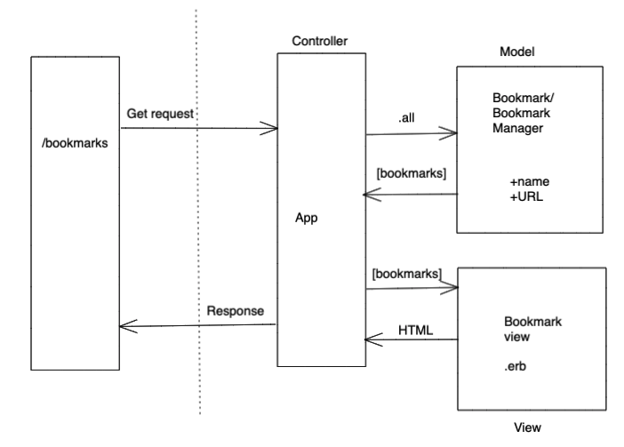

# bookmark_manager

User Story 1
As a user, so I can find my regular websites,
I would like to see a list of bookmarks.

## Instructions

Connect to `psql`

Create database `CREATE DATABASE bookmark_manager;`

Connect to database `\c bookmark_manager;`

Run query we have saved `01_create_bookmarks_table.sql`
